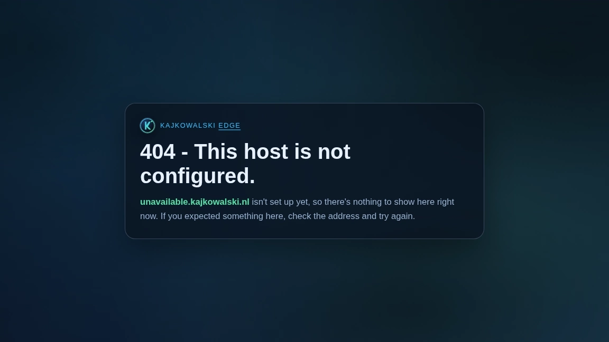

# 404 - This host is not configured

[](https://npm.im/@kjanat/404-page)

Custom 404 error page for [KajKowalski Edge](https://404.kjanat.com).

<a href="https://404.kjanat.com" title="Visit the 404 page">
<picture>
  <source media="(prefers-color-scheme: dark)" srcset="preview-dark.webp">
  <source media="(prefers-color-scheme: light)" srcset="preview-light.webp">
  
</picture>
</a>

<details>
<summary>View opposite theme preview</summary>
<picture>
  <source media="(prefers-color-scheme: dark)" srcset="preview-light.webp">
  <source media="(prefers-color-scheme: light)" srcset="preview-dark.webp">
  
</picture>
</details>

> A storm-themed page that displays "404 - This host is not configured" when a
> visitor reaches an unconfigured hostname.\
> The page dynamically inserts the current hostname, features animated lightning
> bolts over a dark atmospheric background, and automatically activates a calm
> mode for users who prefer reduced motion.

<details><summary>add 404 page to a github pages deployment</summary>

```yaml
- run: curl -fsSLo dist/404.html https://esm.sh/@kjanat/404-page/index.html
```

or use the composite action (writes `404.html` into `directory`):

```yaml
- uses: kjanat/404@master
  with: { directory: dist/site }
```

The action bakes in `mode: path` by default, so the page reads as "this link is
broken, the site is fine" with climb-up links — the right voice for Pages, where
a 404 means the path is missing, not the whole host. Set `mode: domain` for an
unconfigured-host page, or `mode: auto` to detect at runtime instead.

```yaml
- uses: kjanat/404@master
  with: { directory: dist/site, mode: auto }
```

Note that `mode: auto` is weaker than the default on Pages: runtime detection
only upgrades to the path voice when it can prove the site is live — a same-host
referrer or a `*.github.io` host. A direct hit on a **custom** Pages domain (or
traffic arriving from another site) falls back to domain voice, which is why
`path` is baked in by default.

</details>

<!-- markdownlint-disable-file no-inline-html -->
<!-- rumdl-disable-file no-inline-html -->
